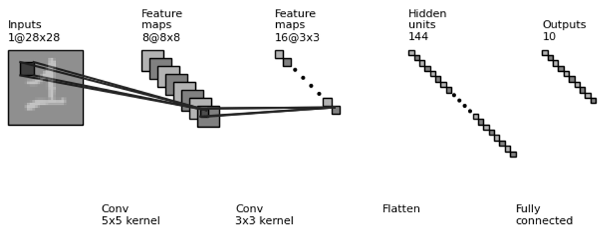
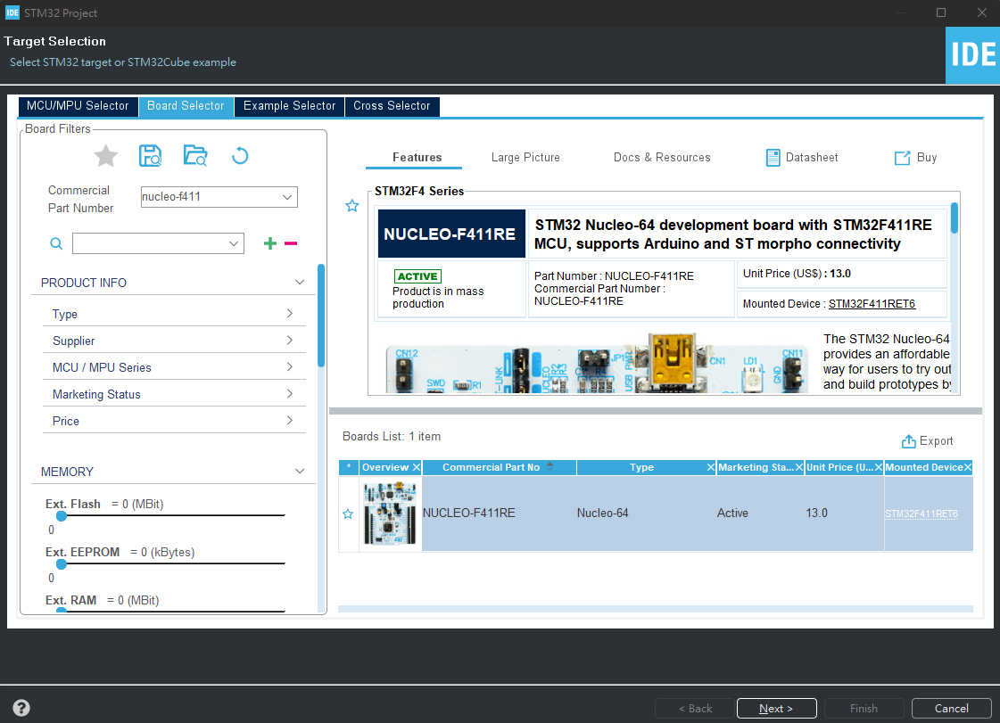
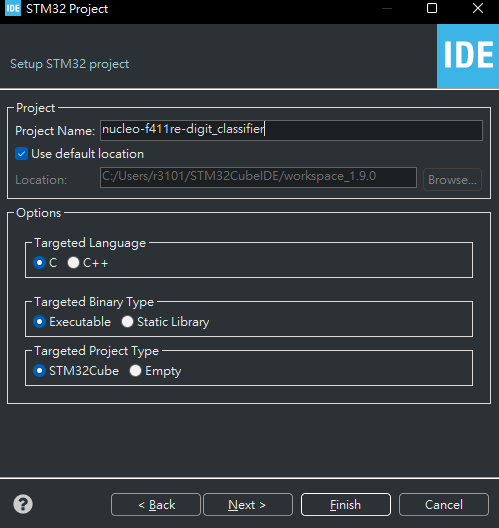

# **Implement MNIST Handwritten Digit Classification on MCU**
This repository demonstrate how to implement CNN on MCU by using STM32 X-Cube-AI.
| Environment | <!-- -->             |
|-------------|----------------------|
| OS          | Win11                |
| MCU         | NUCLEO-F411RE        |
| Python      | 3.9.12               |
| Keras       | 2.6.0                |
| Tensorflow  | 2.8.0                |
| X-Cube-AI   | 7.2.0                |
| IDE         | VScode, STM32CubeIDE |

Workflow:
1. Using Keras build classification model.
2. Create STM32 project.
3. Testing classification performance on MCU

# Using Keras build classification model.
```
python3 train_model.py
```

---
Model Summary
---
|Layer (type)           |      Output Shape         |     Param #   |
|-----------------------|---------------------------|---------------|
|input_1 (InputLayer)   |      [(None, 28, 28, 1)]  |     0         |
|conv2d (Conv2D)        |      (None, 8, 8, 8)      |     208       |
|conv2d_1 (Conv2D)      |      (None, 3, 3, 16)     |     1168      |
|flatten (Flatten)      |      (None, 144)          |     0         |
|dense (Dense)          |      (None, 10)           |     1450      |

Total params: 2,826\
Trainable params: 2,826\
Non-trainable params: 0

# Create STM32 project.
## Step 1 Create New STM32 project:
1. Select NUCLEO-F411RE\
    
2. Create STM32 Project\
    


## Step 2 Setup STM32 Peripherals:
### 1. **X-Cube-AI**
- Click Software Packs -> Select Components
    
- Enable X-CUBE-AI Core
    
- Add Network
    - Software Packs -> STMicroelectronics.X-CUBE-AI.7.2.0 -> Add network
    - Change model name to digit_cnn
    - Click Browse button select pre-trained model digit_classifier_CNN.h5
    - Software Packs -> STMicroelectronics.X-CUBE-AI.7.2.0 -> Analyze
    
- Software Packs -> STMicroelectronics.X-CUBE-AI.7.2.0 -> Show graph\    
    

### 2. **Activate TIM11**


### 3. **Enable Virtual Com Port Global Interrupt**


### 4. **Enable generate peripheral initalization as a pair of '.c/.h' file per peripheral**


### 5. **Generate code and Replace Scirpt**
- Core/Inc/main.h
- Core/Src/main.c
- Core/Src/stm32f4xx_it.c

### 6. **Upload program to STM32**


# Testing classification performance on MCU
This repository testing architecture shown as below figure.

```
python3 testing_on_mcu.py
```
# Demo Video Link:
* [Using Keras build classification model]
* [Create STM32 project]
* [Testing classification performance on MCU]

# Reference:
* [TensorFlow 2 quickstart for beginners](https://www.tensorflow.org/tutorials/quickstart/beginner)
* [TensorFlow 2 quickstart for experts](https://www.tensorflow.org/tutorials/quickstart/advanced)
* [TinyML: Gettting Started with STM32 X-CUBE-AI](https://www.digikey.tw/en/maker/projects/tinyml-getting-started-with-stm32-x-cube-ai/f94e1c8bfc1e4b6291d0f672d780d2c0)
* X-CUBE-AI Expansion Package Embedded Documentation
